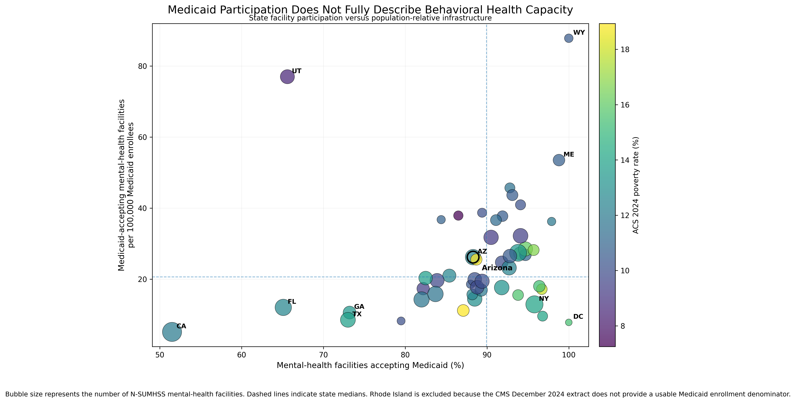
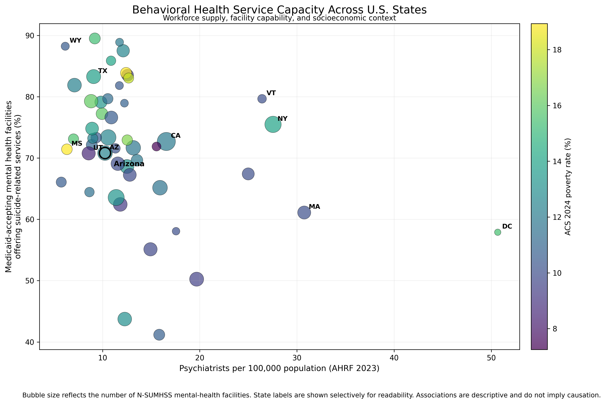

# Medicaid Behavioral Health Capability

A reproducible state-level health services research project examining how
Medicaid participation, behavioral health facility infrastructure,
psychiatrist workforce supply, and socioeconomic context vary across the
United States.

The project integrates four major public data sources:

- **SAMHSA N-SUMHSS 2024** — mental health treatment facilities and services
- **HRSA Area Health Resources Files (AHRF)** — psychiatrist workforce supply
- **U.S. Census ACS 2024 5-year estimates** — socioeconomic context
- **CMS Medicaid enrollment data** — state Medicaid population denominators

The primary analytic geography is the **50 U.S. states plus the District of
Columbia**.

---

## Research Question

A high percentage of mental health facilities accepting Medicaid does not
necessarily mean that a state has substantial behavioral health
infrastructure relative to the size of its Medicaid population.

This project therefore distinguishes between two related measures:

### Medicaid participation

> What percentage of mental health treatment facilities accepts Medicaid?

### Population-relative Medicaid behavioral health infrastructure

> How many Medicaid-accepting mental health treatment facilities exist per
> 100,000 Medicaid enrollees?

The project also explores how psychiatrist workforce supply and
socioeconomic context relate to selected capabilities among
Medicaid-accepting mental health facilities.

---

## Why This Distinction Matters

Consider two states where 90% of mental health facilities accept Medicaid.

That percentage alone does not reveal whether one state has:

- 10 Medicaid-accepting facilities per 100,000 Medicaid enrollees

while another has:

- 40 Medicaid-accepting facilities per 100,000 Medicaid enrollees.

Participation and population-relative infrastructure describe different
dimensions of the behavioral health system.

This project builds both measures.

---

## Data Architecture

```text
                    N-SUMHSS 2024
              Mental health facilities
                       |
                       |
            Medicaid participation
            + service capabilities
                       |
                       v
               STATE-LEVEL DATA
                       ^
                       |
        +--------------+--------------+
        |              |              |
        |              |              |
   AHRF 2023       ACS 2024      CMS Dec 2024
   Psychiatrist    Poverty        Medicaid
   workforce       Income         enrollment
```

The sources are integrated into a reproducible state-level analytic
dataset.

---

## Key Findings

### 1. Medicaid participation varies substantially across states

The percentage of mental health treatment facilities accepting Medicaid
ranged widely across the United States.

Examples include:

| State | Facilities accepting Medicaid |
|---|---:|
| Wyoming | 100.0% |
| Maine | 98.8% |
| New York | 95.8% |
| Arizona | 88.3% |
| Texas | 73.0% |
| Florida | 65.1% |
| Utah | 65.6% |
| California | 51.5% |

---

### 2. Arizona's facility profile differs across service dimensions

Among Medicaid-accepting mental health facilities in Arizona:

| Capability | Arizona |
|---|---:|
| Outpatient treatment | 78.8% |
| Day treatment / partial hospitalization | 13.1% |
| Residential treatment | 22.7% |
| Inpatient treatment | 7.5% |
| Suicide-related services | 70.8% |
| SMI / co-occurring substance use services | 87.6% |
| Primary care integration | 39.9% |

Compared with the national Medicaid-accepting facility profile, Arizona
showed particularly notable descriptive differences in residential
treatment and primary care integration.

---

### 3. Psychiatrist supply does not map straightforwardly onto facility capability

Initial state-level Spearman analyses identified negative associations
between psychiatrist supply and several facility capability measures.

After false discovery rate correction, associations involving:

- outpatient treatment
- suicide-related services

remained statistically significant in the 51-jurisdiction analysis.

When the District of Columbia was excluded, associations involving:

- outpatient treatment
- suicide-related services
- SMI / co-occurring substance use services

remained significant after FDR correction.

These ecological associations should **not** be interpreted causally.

---

### 4. The adjusted suicide-service relationship was imprecise

An exploratory multivariable model included:

- psychiatrists per 100,000 population
- poverty rate
- median household income

with HC3 heteroskedasticity-robust standard errors.

For psychiatrist supply:

| Model | Coefficient | Robust SE | p-value | 95% CI |
|---|---:|---:|---:|---:|
| All 51 jurisdictions | -0.292 | 0.335 | 0.383 | -0.948 to 0.364 |
| Excluding DC | -0.297 | 0.373 | 0.426 | -1.028 to 0.434 |

The adjusted association was therefore imprecisely estimated.

---

### 5. Medicaid participation and population-relative infrastructure tell different stories

Across states with usable CMS Medicaid enrollment denominators, the median
values were:

- **90.0%** of mental health facilities accepting Medicaid
- **20.65** Medicaid-accepting mental health facilities per 100,000 Medicaid
  enrollees

Arizona had:

- **88.3%** Medicaid facility participation
- **26.20** Medicaid-accepting mental health facilities per 100,000 Medicaid
  enrollees

Arizona therefore had a participation percentage slightly below the state
median while its population-relative facility measure was above the state
median.

This illustrates why participation percentage alone does not fully
describe behavioral health infrastructure.

---

## Main Visualization



**X-axis:** percentage of mental health facilities accepting Medicaid  
**Y-axis:** Medicaid-accepting mental health facilities per 100,000 Medicaid
enrollees  
**Bubble size:** number of mental health treatment facilities  
**Bubble shading:** state poverty rate

Dashed lines indicate state medians.

Rhode Island is excluded from denominator-based capacity calculations
because the December 2024 CMS extract used in this project reports an
unusable zero Medicaid enrollment value.

---

## Additional Visualization



This exploratory visualization combines psychiatrist supply, suicide-service
capability, facility counts, and state poverty context.

---

## Data Sources

### SAMHSA N-SUMHSS 2024

Used to identify:

- mental health treatment facilities
- Medicaid acceptance
- outpatient treatment
- day treatment / partial hospitalization
- residential treatment
- inpatient treatment
- suicide-related services
- SMI / co-occurring substance use services
- primary care integration

### HRSA Area Health Resources Files

Used to construct state psychiatrist workforce measures, including
psychiatrists per 100,000 population.

### U.S. Census Bureau ACS

2024 ACS 5-year estimates were retrieved programmatically through the
Census Data API.

Measures include:

- state population
- poverty rate
- median household income

### CMS Medicaid Enrollment

December 2024 updated Medicaid enrollment data were used to construct
population-relative behavioral health infrastructure measures.

---

## Statistical Methods

The project includes:

- descriptive state comparisons
- Pearson correlations
- Spearman rank correlations
- false discovery rate correction
- sensitivity analysis excluding the District of Columbia
- exploratory multivariable OLS regression
- HC3 heteroskedasticity-robust standard errors

All analyses are observational and ecological.

---

## Repository Structure

```text
Medicaid-Behavioral-Health-Capability/
|
|-- docs/
|   |-- methodology.md
|   |-- results.md
|   |-- limitations.md
|   `-- reproducibility.md
|
|-- results/
|   |-- figures/
|   `-- tables/
|
|-- src/
|   |-- inspect_nsumhss.py
|   |-- inspect_ahrf.py
|   |-- inspect_directory.py
|   |-- analyze_nsumhss.py
|   |-- analyze_ahrf.py
|   |-- integrate_state_data.py
|   |-- fetch_acs.py
|   |-- integrate_acs.py
|   |-- fetch_cms_enrollment.py
|   |-- integrate_cms.py
|   |-- analyze_integrated.py
|   |-- model_state_capability.py
|   |-- visualize_integrated.py
|   `-- visualize_medicaid_capacity.py
|
|-- .gitignore
|-- LICENSE
`-- README.md
```

---

## Reproducible Workflow

The project follows a staged pipeline:

```text
Inspect
   |
   v
Clean
   |
   v
Construct analytic cohorts
   |
   v
Aggregate to state level
   |
   v
Integrate public datasets
   |
   v
Quality control
   |
   v
Statistical analysis
   |
   v
Sensitivity analysis
   |
   v
Visualization
   |
   v
Research documentation
```

Detailed instructions are available in
[`docs/reproducibility.md`](docs/reproducibility.md).

---

## Research Documentation

Additional documentation:

- [Methodology](docs/methodology.md)
- [Results](docs/results.md)
- [Limitations](docs/limitations.md)
- [Reproducibility](docs/reproducibility.md)

---

## Limitations

This project measures behavioral health **infrastructure**, not realized
patient access.

Facility counts do not directly measure:

- treatment slots
- clinician staffing
- appointment availability
- waiting times
- geographic accessibility
- network participation
- service quality
- utilization

The integrated sources also represent slightly different reference periods.

See the full [limitations document](docs/limitations.md).

---

## Technical Skills Demonstrated

This project demonstrates applied experience with:

### Data engineering

- multi-source public health data integration
- data cleaning and validation
- geographic identifier harmonization
- missing-data handling
- reproducible data pipelines

### Python

- pandas
- matplotlib
- scipy
- statsmodels
- requests
- python-dotenv
- openpyxl

### Statistical analysis

- descriptive statistics
- correlation analysis
- rank-based methods
- multiple-testing correction
- sensitivity analysis
- multivariable regression
- robust standard errors

### Public-data infrastructure

- SAMHSA public-use data
- HRSA AHRF
- Census Data API
- CMS Medicaid data

### Research practice

- explicit cohort construction
- denominator validation
- reproducible workflows
- ecological interpretation
- sensitivity analysis
- research documentation
- version control with Git/GitHub

---

## Environment

The project was developed using Python 3.14.

Core dependencies are listed in `requirements.txt`.

Install them with:

```bash
py -m pip install -r requirements.txt
```

Census API credentials should be stored locally in a `.env` file and must
not be committed to version control.

Example:

```text
CENSUS_API_KEY=your_api_key_here
```

The repository `.gitignore` excludes `.env` and project data files that
should remain local.

## Interpretation

The central lesson of the project is that **Medicaid participation and
behavioral health infrastructure are related but not interchangeable**.

Knowing the percentage of facilities that accepts Medicaid is useful, but it
does not reveal how much facility infrastructure exists relative to the
Medicaid population.

Combining facility participation with population-relative measures provides
a more informative descriptive view of state Medicaid behavioral health
systems while still recognizing that facility counts alone do not measure
realized patient access.